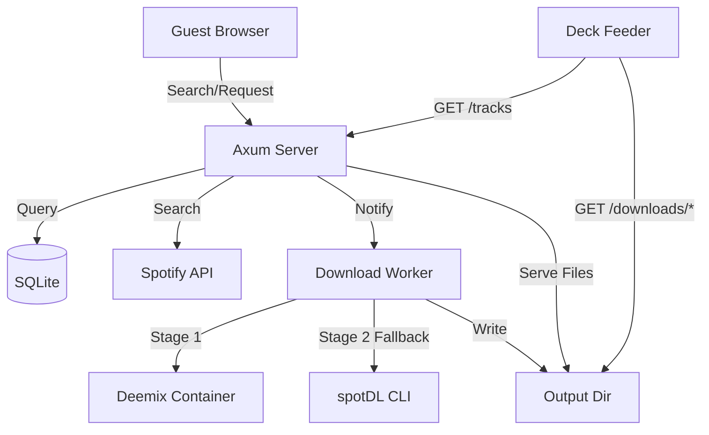

# 🎵 Wish

**Song request server** — guests search across Spotify, YouTube, and SoundCloud and submit track links. The server downloads tracks through a multi-stage pipeline (deemix → spotDL → yt-dlp). Downloaded files are served over HTTPS for [Deck Feeder](https://github.com/momokli/deck-feeder).

Built with **Rust** (Axum/SQLx/SQLite), embedded SPA frontend (vanilla JS/HTML/CSS).

## Quick Start

```bash
# Build
cargo build --release

# Run
cargo run -- serve

# Or specify a port
cargo run -- serve --port 8080
```

The server starts at `http://localhost:3000`. Open your browser to see the song request UI.

## Configuration

Configuration is loaded with priority: **env vars > `~/.config/wish/config.toml` > defaults**.

### Config file (`~/.config/wish/config.toml`)

```toml
[spotify]
client_id     = "your_spotify_client_id"
client_secret = "your_spotify_client_secret"

[deemix]
base_url = "http://localhost:6596"

[download]
output_dir = "/opt/download-service/downloads/tracks"
max_per_user = 5
```

### Environment variables

| Variable                     | Description               | Default                   |
| ---------------------------- | ------------------------- | ------------------------- |
| `WISH_SPOTIFY_CLIENT_ID`     | Spotify API client ID     | (empty)                   |
| `WISH_SPOTIFY_CLIENT_SECRET` | Spotify API client secret | (empty)                   |
| `WISH_DEEMIX_BASE_URL`       | Deemix API URL            | `http://localhost:6596`   |
| `WISH_DOWNLOAD_OUTPUT_DIR`   | Download output directory | `./downloads`             |
| `WISH_DOWNLOAD_MAX_PER_USER` | Rate limit per session    | `5`                       |
| `WISH_PORT`                  | Server port               | `3000`                    |
| `DATABASE_URL`               | SQLite database URL       | `sqlite:wish.db?mode=rwc` |

## API Endpoints

### Public (guest-facing)

| Endpoint                    | Method | Description                                                              |
| --------------------------- | ------ | ------------------------------------------------------------------------ |
| `/`                         | GET    | Embedded SPA frontend (search + request UI)                              |
| `/search?q={query}&limit=5` | GET    | Spotify track search                                                     |
| `/download`                 | POST   | Submit `{"url": "spotify:track:..."}` for download                       |
| `/queue`                    | GET    | List submitted tracks with download status                               |
| `/stats`                    | GET    | `{total, ready, failed, pending}`                                        |
| `/health`                   | GET    | `{status:"ok", deemix_configured, spotify_configured, spotdl_available}` |

### Deck Feeder integration

| Endpoint                | Method | Description                                               |
| ----------------------- | ------ | --------------------------------------------------------- |
| `/tracks`               | GET    | List downloadable files: `[{filename, size, url, ready}]` |
| `/downloads/{filename}` | GET    | Serve a downloaded file (supports Range requests)         |

### curl examples

```bash
# Health check
curl localhost:3000/health

# Search Spotify
curl "localhost:3000/search?q=daft+punk&limit=3"

# Submit a track
curl -X POST localhost:3000/download \
  -H 'Content-Type: application/json' \
  -d '{"url":"spotify:track:4cOdK2wGLETKBW3PvgPWqT"}'

# View queue
curl localhost:3000/queue

# Get stats
curl localhost:3000/stats

# List downloadable tracks (for Deck Feeder)
curl localhost:3000/tracks
```

## Download Pipeline

Two-stage, non-blocking:

```
POST /download {url: "spotify:track:xxx"}
  → INSERT INTO submissions (url, status="pending")
  → Background worker picks it up:
    1. deemix: POST http://localhost:6596/api/addToQueue
       → Polls GET /api/getQueue until done
       → Success → status="ready"
    2. spotDL (fallback): if deemix fails
       → spotdl download <spotify_url> --output <output_dir>
       → Success → status="ready"
       → Failure → status="failed"
```

**Status lifecycle**: `pending` → `stage2_deemix` → `stage3_spotdl` → `ready` | `failed`

## Architecture



## Deployment

### Prerequisites

- [Deemix](https://gitlab.com/Bockiii/deemix-pyweb) running as a Docker container on `localhost:6596`
- [spotDL](https://github.com/spotDL/spotify-downloader) installed on PATH
- Spotify API credentials (from [Spotify Developer Dashboard](https://developer.spotify.com/dashboard/))

### Caddy reverse proxy

```caddy
wish.example.com {
    reverse_proxy localhost:3000
}
```

### systemd service

```ini
[Unit]
Description=Wish Song Request Server
After=network.target

[Service]
Type=simple
User=wish
ExecStart=/opt/wish/wish serve
Restart=always
Environment=WISH_PORT=3000
Environment=DATABASE_URL=sqlite:/opt/wish/wish.db?mode=rwc

[Install]
WantedBy=multi-user.target
```

## Development

```bash
# Build
cargo build

# Run tests (must pass with zero failures)
cargo test

# Run a specific test file
cargo test --test api_submissions

# Create a new migration
touch migrations/002_description.sql

# Check DB schema
sqlite3 wish.db ".schema"
```

## License

MIT
