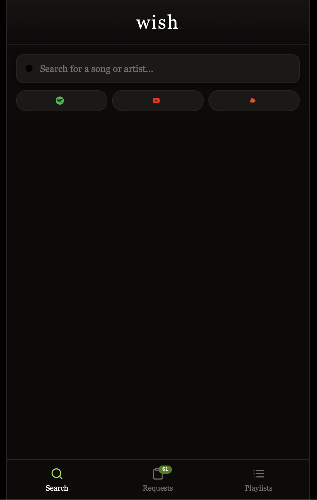
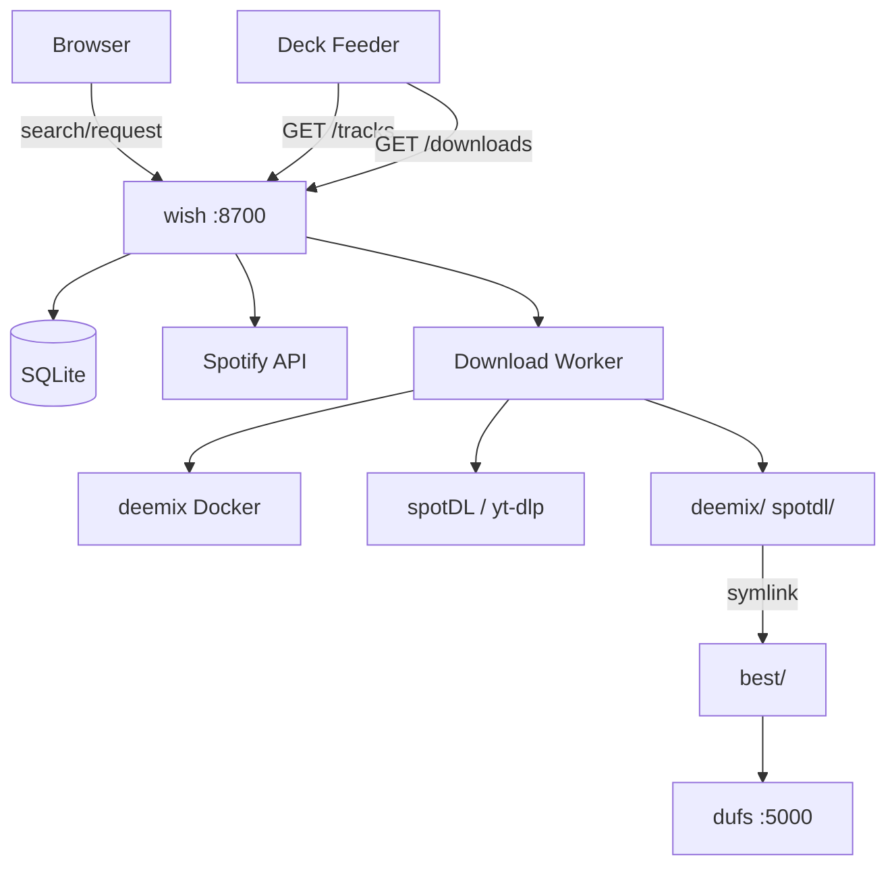

# wish

Song request server for DJs. Guests search Spotify, YouTube, and SoundCloud,
submit tracks, and the server downloads them through a multi-stage pipeline.
Files are served for [Deck Feeder](https://github.com/momokli/deck-feeder).

Built with Rust (Axum, SQLx, SQLite) and a vanilla JS frontend embedded in the binary.



## Quick Start

```bash
cargo build --release
cargo run -- serve
```

Opens at `http://localhost:3000`.

## Config

Priority: env vars > `~/.config/wish/config.toml` > defaults.

```toml
# ~/.config/wish/config.toml
[spotify]
client_id     = "..."
client_secret = "..."

[deemix]
base_url = "http://localhost:6596"
arl      = "..."

[download]
output_dir    = "/opt/wish-downloads"
max_per_user  = 5
```

Environment variables: `WISH_SPOTIFY_CLIENT_ID`, `WISH_SPOTIFY_CLIENT_SECRET`,
`WISH_DEEMIX_BASE_URL`, `WISH_DEEMIX_ARL`, `WISH_DOWNLOAD_OUTPUT_DIR`,
`WISH_PORT`, `DATABASE_URL`.

## API

### Public

| Endpoint                             | Method | Description                                      |
| ------------------------------------ | ------ | ------------------------------------------------ |
| `/`                                  | GET    | Frontend SPA                                     |
| `/search?q=…&limit=5&source=spotify` | GET    | Multi-source search (spotify/youtube/soundcloud) |
| `/download`                          | POST   | Submit `{"url":"…","source":"…"}` for download   |
| `/queue`                             | GET    | All submissions with status                      |
| `/stats`                             | GET    | `{total, ready, failed, pending}`                |
| `/health`                            | GET    | Service status                                   |

### Playlists

| Endpoint               | Method | Description                |
| ---------------------- | ------ | -------------------------- |
| `/playlists`           | GET    | List subscribed playlists  |
| `/playlists`           | POST   | Add playlist `{"url":"…"}` |
| `/playlists/{id}`      | DELETE | Remove playlist            |
| `/playlists/{id}/sync` | POST   | Force re-sync              |

### Deck Feeder

| Endpoint                | Method | Description                      |
| ----------------------- | ------ | -------------------------------- |
| `/tracks`               | GET    | `[{filename, size, url, ready}]` |
| `/downloads/{filename}` | GET    | Serve file with Range support    |

### Admin

| Endpoint      | Method | Description                                      |
| ------------- | ------ | ------------------------------------------------ |
| `/admin`      | GET    | Admin SPA                                        |
| `/admin/data` | GET    | All submissions with attempt logs, bitrate, ISRC |

## Download Pipeline

```
POST /download → status=pending
  → L1: deemix (320kbps MP3 from Deezer)
    → success → ready, symlinked into best/
  → L2: spotDL (fallback)
    → success → ready, symlinked into best/
  → L3: yt-dlp (last resort)
    → success → ready, symlinked into best/
  → all failed → status=failed
```

YouTube and SoundCloud URLs go directly to yt-dlp.

## File Layout

Downloads are split by source with a unified `best/` directory:

```
output_dir/
├── deemix/   ← 320kbps MP3 from Deezer
├── spotdl/   ← fallback downloads
└── best/     ← symlinks to the best available version per track
```

ISRC-based dedup: if both deemix and spotDL download the same track,
`best/` only links to the deemix version.

A standalone [dufs](https://github.com/sigoden/dufs) instance serves `best/`
for browsing and streaming (e.g., `fairy.zukkafabrik.de`).

## Architecture


```mermaid
graph TD
    A[Browser] -->|search/request| B[wish :8700]
    B --> C[(SQLite)]
    B --> D[Spotify API]
    B --> E[Download Worker]
    E --> F[deemix Docker]
    E --> G[spotDL / yt-dlp]
    E --> H[deemix/ spotdl/]
    H -->|symlink| I[best/]
    I --> J[dufs :5000]
    K[Deck Feeder] -->|GET /tracks| B
    K -->|GET /downloads| B
```

## Deployment

Prerequisites: deemix Docker container, spotDL on PATH, yt-dlp on PATH,
Spotify API credentials.

### systemd

```ini
[Unit]
Description=Wish Song Request Server
After=network.target

[Service]
Type=simple
User=momo
ExecStart=/home/momo/wish/target/release/wish serve
Restart=on-failure
Environment=WISH_PORT=8700
Environment=DATABASE_URL=sqlite:/home/momo/wish/wish.db?mode=rwc

[Install]
WantedBy=multi-user.target
```

### Caddy

```caddy
wish.example.com {
    reverse_proxy 127.0.0.1:8700
}

files.wish.example.com {
    reverse_proxy 127.0.0.1:5000
}
```

### Ansible

See `ansible/` for inventory and playbook. Targets: `music` (wish binary) and `lan` (Caddy config).

## Dev

```bash
cargo build
cargo test
bash scripts/validate.sh       # full check: build, test, lint, frontend
node scripts/build-html.mjs    # rebuild embedded frontend
```

Migrations are timestamped SQL files in `migrations/` — just add a new file,
`sqlx::migrate!` handles the rest. Never modify existing migrations.

## License

MIT
